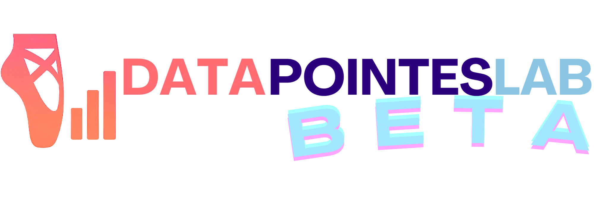

# Data Pointes Lab Database

<div align="center">
  
  
  **Open-source database of pointe shoe specifications and characteristics for ballet dancers, fitters, and researchers.**
  
  [](https://creativecommons.org/licenses/by/4.0/)
  []()
  []()
  []()
</div>

## ⚠️ IMPORTANT DISCLAIMERS & LIABILITY LIMITATIONS

**🚨 BY USING THIS DATA, YOU ACKNOWLEDGE AND AGREE TO THESE TERMS 🚨**

**CRITICAL NOTICE:** This data is provided for informational purposes only. Pointe work is inherently dangerous and can cause serious injuries. Always consult qualified medical professionals and certified ballet instructors before beginning pointe work. We assume no liability for any injuries, damages, or losses resulting from use of this data.

<details>
<summary><strong>📋 Click to expand full liability disclaimer and legal terms</strong></summary>

### 🛡️ COMPLETE LIABILITY DISCLAIMER

**WE ARE NOT RESPONSIBLE FOR:**
- **Any injuries or damages** from using this data to select, purchase, or wear pointe shoes
- **Physical harm** including foot, ankle, leg injuries, or other bodily harm from pointe work
- **Financial losses** from inappropriate purchases or unsuitable footwear
- **Professional consequences** from footwear-related injuries or performance issues
- **Any direct, indirect, incidental, or consequential damages** of any kind

### ⚕️ CRITICAL SAFETY WARNING

**POINTE WORK IS INHERENTLY DANGEROUS** and can cause serious injuries including stress fractures, tendon damage, nerve damage, and chronic pain conditions.

**MANDATORY REQUIREMENTS:**
- Always consult qualified medical professionals before beginning pointe work
- Work only with certified ballet instructors and professional fitters
- This data is NOT a substitute for professional fitting or medical advice
- Individual foot anatomy, strength, and training history are critical factors not captured in this data

### 📊 DATA LIMITATIONS

**NO WARRANTIES:** Data provided "AS-IS" with no guarantees of accuracy, completeness, or fitness for purpose.

**DATA MAY BE OUTDATED:** Specifications, availability, and pricing change frequently. Always verify with manufacturers.

**HIGHLY INDIVIDUAL:** Pointe shoe selection depends on numerous personal factors not included in this database.

### ⚖️ LEGAL TERMS

- **USE AT YOUR OWN RISK:** All use is entirely at your discretion and risk
- **ASSUMPTION OF RISK:** You assume all risks associated with pointe shoe selection and use
- **LIMITATION OF LIABILITY:** Maximum liability limited to $0 (the cost of this free data)
- **INDEMNIFICATION:** Users agree to hold developers/creators harmless from any claims
- **COMMERCIAL USE:** Business users assume full responsibility for decisions and compliance

</details>

## 📊 What's Included

This comprehensive dataset contains detailed specifications for **375+ pointe shoe models** from **15 major manufacturers**:

### Data Fields
- **Basic Information**: Brand, model, availability
- **Physical Characteristics**: Box shape, platform width, shank strength, vamp length
- **Fit Details**: Wing height, heel height, arch support
- **Performance**: Durability ratings, intended foot shapes
- **Commercial**: Price ranges, available sizes/widths, customization options
- **Materials**: Composition details where available

### Supported Brands
- Bloch
- Capezio  
- Chacott
- FR Duval
- Freed of London
- Gaynor Minden
- Grishko/Nikolay
- Merlet
- Mirella
- R-Class
- Russian Pointe
- Sansha
- So Danca
- Suffolk
- Wear Moi

## 📁 Repository Structure

```
datapointeslab-database/
├── README.md                    # This file
├── LICENSE                      # CC BY 4.0 License
├── CHANGELOG.md                 # Version history
├── data/
│   ├── pointe_shoes.json       # Main dataset (JSON format)
│   ├── STANDARD_POINTES_DB_CONSOLIDATED.xlsx  # Excel format
│   └── schema.json             # Data schema documentation
├── docs/
│   ├── DATA_DICTIONARY.md      # Field definitions
│   ├── METHODOLOGY.md          # Data collection methods
│   └── CONTRIBUTING.md         # How to contribute
├── scripts/
│   ├── validate_data.py        # Data validation scripts
│   └── export_formats.py       # Format conversion utilities
└── assets/
    ├── logo.png                # Data Pointes Lab logo
    └── logo_inverted_small_logo.png  # Inverted logo variant
```

## 🚀 Quick Start

### Download the Data

**JSON Format** (Recommended for developers):
```bash
curl -O https://raw.githubusercontent.com/4dh/datapointeslab-database/main/data/pointe_shoes.json
```

**Excel Format** (Recommended for researchers):
```bash
curl -O https://raw.githubusercontent.com/4dh/datapointeslab-database/main/data/STANDARD_POINTES_DB_CONSOLIDATED.xlsx
```

### Using the Data

#### Python Example
```python
import json
import pandas as pd

# Load JSON data
with open('pointe_shoes.json', 'r') as f:
    shoes_data = json.load(f)

# Convert to DataFrame
df = pd.DataFrame(shoes_data)

# Example: Find all shoes with medium box shape
medium_box_shoes = df[df['box_shape'] == 'Medium']
print(f"Found {len(medium_box_shoes)} shoes with medium box shape")
```

#### R Example
```r
library(jsonlite)
library(dplyr)

# Load data
shoes_data <- fromJSON("pointe_shoes.json")

# Example: Analyze price ranges by brand
price_analysis <- shoes_data %>%
  group_by(brand) %>%
  summarise(
    avg_min_price = mean(price_min, na.rm = TRUE),
    avg_max_price = mean(price_max, na.rm = TRUE)
  )
```

## 📚 Data Sources

This database aggregates information from multiple sources to provide comprehensive pointe shoe specifications:

| Source Type | Description | Coverage | Last Updated | Reliability |
|-------------|-------------|----------|--------------|-------------|
| **Manufacturer Websites** | Official product specifications and catalogs | All brands | 2024-06 | High |
| **Authorized Retailers** | Product listings and detailed specifications | Major models | 2024-06 | High |
| **Dance Supply Stores** | Professional fitting guides and product details | Popular models | 2024-05 | Medium-High |
| **Dancer Communities** | User reviews and real-world experience | Various models | 2024-06 | Medium |
| **Industry Publications** | Magazines and professional reviews | New releases | 2024-05 | Medium-High |


### Source Verification Process

1. **Primary Sources**: Manufacturer websites and official documentation (highest priority)
2. **Cross-Reference**: Multiple sources verified against each other
3. **Community and ExpertValidation**: Experienced dancers provide real-world feedback
4. **Continuous Updates**: Regular monitoring of source changes

### Data Quality Notes

- **Manufacturer Data**: Most reliable for current models, may lack detailed fitting characteristics
- **Retailer Data**: Good for availability and pricing, specifications may vary
- **Professional Input**: Excellent for fitting nuances, limited to fitter experience
- **Community Data**: Valuable for real-world performance, subject to individual variation
- **Historical Data**: Important for completeness, may be less accurate due to age
- **AI-Assisted Research**: Claude Sonnet and OpenAI GPT-4.1 assisted in data collection, research, and validation processes

### Known Limitations

- Some discontinued models may have incomplete specifications
- Pricing data reflects approximate ranges and varies by region
- Customization options may not reflect all available variations
- New model releases may have limited initial data

## 🤝 Contributing

We welcome contributions! Please see [CONTRIBUTING.md](docs/CONTRIBUTING.md) for guidelines.

### Ways to Contribute
- **Data Updates**: Submit corrections or new shoe information
- **Documentation**: Improve explanations and examples
- **Validation**: Help verify data accuracy


## 📄 License & Attribution

This work is licensed under [Creative Commons Attribution 4.0 International License](https://creativecommons.org/licenses/by/4.0/).

### Required Attribution
When using this data, please include:

```
Data from Data Pointes Lab Database
Created by Danielle Heymann
https://github.com/4dh/datapointeslab-database
Licensed under CC BY 4.0
```
not endorsed for commercial use 

## 🔗 Related Projects
- **[Data Pointes Lab](https://datapointeslab.com)** - Interactive pointe shoe matching optimization app and data analytics platform


## 🏷️ Version History

- **v2025.06**: Initial release of open source database (375 shoes, 15 brands)
- **v2025.06**: Beta testing phase of Data Pointes Lab Application

## ⚖️ Legal Notice

This database is provided for informational and educational purposes only. The creators and maintainers of this database:

1. **Make no warranties** about the accuracy, completeness, or reliability of the data
2. **Disclaim all liability** for any damages arising from the use of this data
3. **Do not endorse** any particular brands, products, or retailers
4. **Are not responsible** for any commercial transactions or decisions based on this data
5. **Recommend professional consultation** for all pointe shoe fitting decisions

By using this data, you acknowledge that you have read, understood, and agree to these terms and disclaimers.

---

<div align="center">
  
  
  **Data Pointes Lab** - Empowering dancers through data
</div> 
